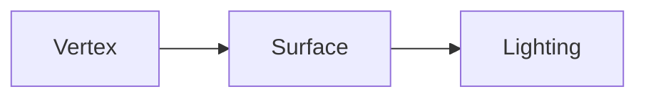
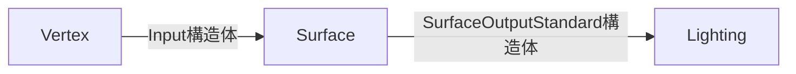

# UnityのShaderについてのメモ

---

## ツールバージョン

- UnityEditor : 2021.3.16f1

---

## マテリアル、シェーダー、テクスチャについて

- シェーダーとマテリアルは1対1で結びついている
- 同じシェーダーを別々のマテリアルが使用することもできる


テクスチャについては、シェーダー内部で参照を持っているので、以下の図のような関係性になる。

- テクスチャを持たないShaderももちろん作成可能


---

## Queueの描画順

奥から、

1. Background
2. Geometry
3. AlphaTest
4. Transparent
5. Overlay


---

## Shaderの種類


- Surface Shader
  - Unityの独自よりの、比較的簡単に記述できるシェーダー
  - 光源、影の付き方を考慮せずに書くことができる(メリット・デメリット)
  - 色、質感、テクスチャ周りを簡単に変更したいときに使う
- Unlit Shader
  - Shader界では、`Vertex`,`Fragment Shader`と呼ばれている
  - Unlit : Un Lighted, Un Illuminated
  - Vertex Shader : 頂点を制御するシェーダー
  - Fragment Shader : 最終的な出力を決定するシェーダー
  - 光源の影響を受けないシェーダー
  - Surface Shaderより、`光源や影`を考慮して実装する必要があるため、記述レベルは高い
- Image Effect Shader
  - ポストエフェクトなどに使用するシェーダー
- Compute Shader
  - GPUを使うことができるシェーダー
- Ray Tracing Shader

### 参考

Shader について

- [Shader の種類](http://neareal.com/2413/#vertexfragment)

---

## Surface Shader

頂点情報の変更や、光源、影の付け方についての記述はできない

具体的な処理の記述は、`surf関数`内に記述していきます。

- 具体的に表現すると、`SurfaceOutputStandard`が次の処理(lighting)への参照になるので、次の処理へ渡す値を設定している
  - o.Albedo : この`o`が次の処理への参照変数なので、その変数の`Albedo`というメンバ変数を変更することで結果が変わるということになる。

---

## シンプルな方法でShaderの色を指定してみる

このシェーダーは、外部から設定できる情報は何もなく、決められた色を表現するしかできないシンプルなシェーダー

```c
Shader "DShader/Simple"
{
  //  Parameters
  //  Parameters
  SubShader
  {
    //  Shader Settings
    Tags { "RenderType"="Opaque" }
    LOD 200

    CGPROGRAM
    #pragma surface surf Standard fullforwardshadows
    #pragma target 3.0
    //  Shader Settings

    //  Surface Shader
    //  前の工程(Vertex)のシェーダーからの情報を受け取る
    struct Input
    {
      float2 uv_MainTex;
    };

    // あとの工程(Lighting)に出力する
    void surf (Input IN, inout SurfaceOutputStandard o)
    {
      o.Albedo = fixed4(1.0f,1.0f,1.0f,1);
    }
    ENDCG
    //  Surface Shader

  }
  FallBack "Diffuse"
}
```

- Parameters
  - インスペクタに公開する変数を書く
- Shader Settings
  - ライティングや透明度などのシェーダの設定項目を記述
- Surface Shader
  - シェーダ本体のプログラム

Surface Shaderには、`入力`と`出力`がある

- 入力
  - `Input構造体`の中身が空ではコンパイルが通らない

  ```c#
  struct Input
  {
    float2 uv_MainTex;
  };
  ```

- 出力

  ```c#
  void surf (Input IN, inout SurfaceOutputStandard o)
  {
    o.Albedo = fixed4(1.0f,1.0f,1.0f,1);
  }
  ```

---

## Input構造体について

これらの入力は、基本的に、3Dモデルの1ピクセルごとに違う値が入ってきます。

前の工程である程度計算されている場合もありますし、そのままの値が入ってくる場合もあります。

具体的にどのような数値入力されているかについては、数値表示はできないので、色情報として表示しています。

- Input構造体を色として表示しているShaderが入っているパス : `Assets/InputStructure/`

| 変数名         | 型             | 解説                |
|-------------|---------------|-------------------|
| viewDir     | float3        | カメラの向き            |
| color       | float4(Color) | 前の工程で設定された色が入ってくる |
| screenPos   | float4        | 画面上の位置            |
| worldPos    | float3        | ワールド空間上の座標          |
| worldRefl   | float3        | ワールドの反射ベクトル       |
| worldNormal | float3        | ワールド空間上の法線         |

[viewDirの詳細について](#viewdirについて)

---

## SurfaceOutputStandardSpecularが持っている情報

| 変数名        | 型      | 解説                 |
|------------|--------|--------------------|
| Albedo     | fixed3 | ディフューズ色            |
| Specular   | fixed3 | スペキュラー色            |
| Normal     | fixed3 | 書き込まれる場合は、接線空間法線   |
| Emission   | half3  |                    |
| Smoothness | half   | 0=粗い,1=滑らか         |
| Occlusion  | half   | オクルージョン(デフォルト = 1) |
| Alpha      | fixed  | 透明度のアルファ           |

---

## 外部からシェーダーのパラメーターを変更する

パラメーターを変更するには、2種類の方法があります。

1. Inspectorから手動で変更する
2. スクリプトからコードで変更する

### 1. Inspectorから手動で変更する

Inspectorに表示する項目を`Parametersブロック`で定義する必要があります。

注意点として、`Parametersブロック`で定義した項目は、`Surfaceブロック`で更に同じ変数を定義しなければ`surfメソッド`内で使うことができないので注意が必要です。

```c#
Shader "DShader/SimpleTransparent"
{
  Properties{
    //  InspectorにBase Colorとして表示される
    _BaseColor("Base Color",Color) = (1,1,1,1)
  }

  SubShader {

    //  ....省略

    //  SubShader内でPropertiesの項目を使用できるようにするには、内部でも宣言する必要がある
    float4 _BaseColor;

    void surf (Input IN, inout SurfaceOutputStandard o) {
      //  色を適応
      o.Albedo = _BaseColor.rgb;
    }
    ENDCG
  }
  FallBack "Diffuse"
}
```

### 2. スクリプトからコードで変更する

Inspectorから設定しないのであれば、Propertiesブロックは不要で、Surfaceブロック内の定義のみで大丈夫です

- Shader

```c#
Shader "DShader/SimpleTransparent"
{
  Properties{
    //  InspectorにBase Colorとして表示される
    //  _BaseColor("Base Color",Color) = (1,1,1,1)
  }

  SubShader {
    //  ....省略

    //  外部からはSubShader内のメンバ変数にアクセスできる
    float4 _BaseColor;

    void surf (Input IN, inout SurfaceOutputStandard o) {
      //  色を適応
      o.Albedo = _BaseColor.rgb;
    }
    ENDCG
  }
  FallBack "Diffuse"
}
```

- スクリプト

Rendererコンポーネントを取得し、マテリアル経由で対象のメンバ変数に対して値を設定します。

```c#
this.gameObject.GetComponent<Renderer>().material.SetColor("_BaseColor", Color.red);
```

---

## 透過させる

透過させるに注意するのは、

- 描画順
- 透過方法
- 透過度

になります。

### 描画順

`描画順`を考慮しないと、最終的な出力された絵がおかしなことになります。

- 描画順を考慮しなかった場合

  ```c#
  SubShader
  {
    Tags { 
       "Queue"="Background"
    }
    //  ...省略
  ```

   

- 描画順を考慮した場合

  ```c#
  SubShader
  {
    Tags { 
       "Queue"="Transparent"
    }
    //  ...省略
  ```

  

上の例は極端な表現ですが、描画順を考慮しない場合の絵は何か違和感があるのがわかるかと思います。

Shaderでは、描画順は、以下のように`"Queue"="XXX"`をTagに記述することでしていることができます。

```c#
SubShader
{
  //  タグの定義に追加します。
  //  描画時にUnity側が確認して描画処理を最適化してくれます。
  Tags { 
    "Queue"="XXX"
  }

  //  ...省略
```

### 透過方法

`透過方法`を指定する必要があります。

- シンプルな透過シェーダー

  ```c#
  Shader "DShader/SimpleTransparent"
  {
    SubShader {
      Tags { 
        // QueueをTransparent(透過)にする
        "Queue"="Transparent"
      }
      LOD 200

      CGPROGRAM
      //  fullforwrdを消してalpha:fadeを追加
      #pragma surface surf Standard alpha:fade
      #pragma target 3.0

      struct Input {
        float2 uv_MainTex;
      };

      float4 _BaseColor;

      void surf (Input IN, inout SurfaceOutputStandard o) {
        o.Albedo = fixed4(0.6f,0.7f,0.4f,1);
        //  ここで透過度を設定している
        o.Alpha = 0.6;
      }
      ENDCG
    }
    FallBack "Diffuse"
  }
  ```

---

## 視線座標とモデル法線の向きを使って輪郭に行くにつれてエフェクトをかける

Input構造体から取得できる情報として、以下の情報があります。

- worldNormal : 法線の向き
- viewDir :  カメラの向き

これらの値を使って、そのテクセルがモデル上のどの位置として表示されているのかを算出して、エッジを探します。その算出方法に使うのが、`内積`になります。

内積を使って、`モデルの法線の向き`と`カメラの向き`のベクトルがなす角度が何度(cosΘ)かがわかります。

- 内積を計算する場合は、ベクトルが正規化されている必要がありますが、今回使用するのは、法線と向きなので、すでに正規化されています。なのでそのままの値を使用できます。

```c#
float cosTheta = dot(法線の向き,カメラの向き)
```

dot積の答えは、`cosθ`になります。よって、2つのベクトルのなす角の違いによって以下の表の中のような値が取得できます。


cosΘは、2つのベクトルが作るなす角の角度が`狭ければ数値が大きく`、`角度が広ければ数値が小さく`なります。

```c#
角度 : 0° < 90°
cosΘ : 1.0  > 0.0
```

以上の特性から、cosΘの値が大きい場合は、オブジェクトの輪郭部分のテクセル、小さい場合は、内側にテクセルがあると判断できます。

以下はベクトルを可視化した図です。


- 赤矢印 : viewDir
- 緑矢印 : worldNormal

この緑と赤のやじるのなす角を計算しているのが以下のコードです。

```c#
// ...
struct Input
{
  float3 worldNormal;
  float3 viewDir;
};

void surf (Input IN, inout SurfaceOutputStandard o)
{
  //  dot関数を使ってcosΘを求める
  float cosTheta = dot(IN.viewDir, o.Normal);
}
//  ...
```

### 輪郭を淡くする

先ほど計算したcosΘの値を透明度としてそのまま使用することで、輪郭に行く(cosΘが小さくなる)ほど、と透明度が上がるシェーダーが出来上がります。

```c#
Shader "DShader/Edgebler"
{
  SubShader
  {
    Tags { 
      "Queue" = "Transparent" 
    }
    LOD 200

    CGPROGRAM
    // Physically based Standard lighting model, and enable shadows on all light types
    #pragma surface surf Standard alpha:fade

    // Use shader model 3.0 target, to get nicer looking lighting
    #pragma target 3.0

    struct Input
    {
      float3 worldNormal;
      float3 viewDir;
    };

    void surf (Input IN, inout SurfaceOutputStandard o)
    {
      o.Albedo = fixed4(1, 1, 1, 1);
      float cosTheta = dot(IN.viewDir, IN.worldNormal);
      o.Alpha =  cosTheta;
    }
    ENDCG
  }
  FallBack "Diffuse"
}
```


さらにエッジ側の透明度を上げて、輪郭をぼかしたい場合は、pow関数(累乗)を使って計算するといい感じになります。値の大きいほど変化が大きくなるので、グラデーションを強調したい時などに使えます。

```c#
//...
void surf (Input IN, inout SurfaceOutputStandard o)
{
  o.Albedo = fixed4(1, 1, 1, 1);
  float cosTheta = dot(IN.viewDir, IN.worldNormal);
  cosTheta = pow(cosTheta,3);
  o.Alpha =  cosTheta;
}
//...
```


### 輪郭を強調し、氷のような表現

エッジブラーシェーダーの逆バージョンをやるだけなので、`cosΘの結果を反転させるために、1からcosΘを引くコードを追加する`だけです。

```c#
Shader "DShader/Ice"
{
  SubShader
  {
    Tags { 
      "Queue" = "Transparent" 
    }
    LOD 200

    CGPROGRAM
    // Physically based Standard lighting model, and enable shadows on all light types
    #pragma surface surf Standard alpha:fade

    // Use shader model 3.0 target, to get nicer looking lighting
    #pragma target 3.0

    struct Input
    {
      float3 worldNormal;
      float3 viewDir;
    };

    void surf (Input IN, inout SurfaceOutputStandard o)
    {
      o.Albedo = fixed4(1, 1, 1, 1);
      float cosTheta = dot(IN.viewDir, IN.worldNormal);
      o.Alpha =  cosTheta;
    }
    ENDCG
  }
  FallBack "Diffuse"
}
```


これも先ほどと同じで、濃淡をはっきりさせた方がきれいなので、`pow関数`を使うといいかと思います。

```c#
//  ...
void surf (Input IN, inout SurfaceOutputStandard o)
{
  o.Albedo = fixed4(1, 1, 1, 1);
  float cosTheta = dot(IN.viewDir, IN.worldNormal);
  cosTheta = pow(cosTheta,3); //  追加
  o.Alpha =  cosTheta;
}
//  ...
```


### リムライティング

これも氷シェーダーと同じように`cosΘ`を使用することで表現できます。

この時に変更する値は、`Emission`になります。

```c#
Shader "DShader/RimLighting"
{
    SubShader
    {
        Tags { 
            "RenderType" = "Opaque"
        }
        LOD 200

        CGPROGRAM
        #pragma surface surf Standard fullforwardshadows
        #pragma target 3.0

        struct Input
        {
            float3 worldNormal;
            float3 viewDir;
        };

        void surf (Input IN, inout SurfaceOutputStandard o)
        {
            o.Albedo = fixed4(1, 1, 1, 1);
            float cosTheta = 1 - dot(IN.viewDir, IN.worldNormal);
            cosTheta = pow(cosTheta,4);
            o.Emission = cosTheta;
        }
        ENDCG
    }
    FallBack "Diffuse"
}
```


- 輪郭強調版

  ```c#
  //  ...
  void surf (Input IN, inout SurfaceOutputStandard o)
  {
    o.Albedo = fixed4(1, 1, 1, 1);
    float cosTheta = dot(IN.viewDir, IN.worldNormal);
    cosTheta = pow(cosTheta,4); //  追加
    o.Emission =  cosTheta;
  }
  //  ...
  ```


---

## worldReflについて

worldReflはInput構造体で前のパイプラインから受け取っていますが、自前で実装することもできます。

以下のコードが自前で`worldRefl`を実装したものになります。

計算した結果を色として表現する場合は、Input構造体の中のworldReflと同じ色の表現にするには、計算した単位ベクトルworldReflを10倍する必要がありあました。

```c#
Shader "Test/ViewDirOriginalTest"
{
    SubShader
    {
        Tags { "RenderType"="Opaque" }
        LOD 200

        CGPROGRAM
        #pragma surface surf Standard fullforwardshadows

        #pragma target 3.0

        struct Input {
            float3 worldNormal;
            float3 viewDir;
        };

        UNITY_INSTANCING_BUFFER_START(Props)
        UNITY_INSTANCING_BUFFER_END(Props)

        void surf (Input IN, inout SurfaceOutputStandard o) {

            float3 worldRefl = reflect(-IN.viewDir, IN.worldNormal);

            //  なぜか10倍する必要がある
            float r = worldRefl.x * 10;
            float g = worldRefl.y * 10;
            float b = worldRefl.z * 10;

            o.Albedo = float4(r,g,b,1);
        }

        ENDCG
    }
    FallBack "Diffuse"
}
```

---

## viewDirの詳細について

Input構造体に入ってくるviewDirの値は、`shaderが当たったオブジェクトの各テクセル`から見て、どの方向にカメラがあるかという値が入ってきます。(Dirなので単位ベクトル)

```c#
viewDir = (カメラワールド座標 - shaderが当たっているオブジェクトワールド座標).normalized
```

- 検証コード

  ```c#
  Shader "Test/ViewDirTest"
  {
    SubShader
    {
        Tags { "RenderType"="Opaque" }
        LOD 200

        CGPROGRAM
        #pragma surface surf Standard fullforwardshadows

        #pragma target 3.0

        struct Input
        {
            float3 viewDir;
        };


        UNITY_INSTANCING_BUFFER_START(Props)
        UNITY_INSTANCING_BUFFER_END(Props)

        void surf (Input IN, inout SurfaceOutputStandard o)
        {
            //  viewDirの値と色を対応させてデバッグ
            //  (X,Y,Z) = (R,G,B)
            o.Albedo = float4(IN.viewDir,1);
        }
        ENDCG
    }
    FallBack "Diffuse"
  }
  ```

ここで重要なのが、`どの方向`にというところで、`カメラ自体の角度`は関係ないことです。位置に対しての値なので、カメラが同じ位置から見る角度を変えても、`viewDir`の値は変化しません。

viewDirをAlbedoに直接代入した時の色の変化が下の画像になります。

- ()内の数字は、オブジェクトとカメラの中心位置からのviewDirです。モデルの端に行けば行くほど、値がゆっくり変化していきます。


- (R,G,B) = (X,Y,Z)の割り当てになっています。

- 赤い四角が原点(0,0,0)ですが、色の変化を見ても、原点位置から見ると一方こうにしか動いていないのに、色の変化が激しいことがわかります。このことからも、viewDirが`shaderが当たったオブジェクトの各面`からみての座標ということがわかるかと思います。

---

## テクスチャを使用する

_MainTexが外部からテクスチャの参照を受け取るので、受け取ったテクスチャをShader内部で、各ピクセルがInput構造体から受け取った自分の座標(uv_MainTex)をもとにテクスチャから適切な色をサンプリング(Textureから自分のテクスチャ座標の色を取得すること)します。

```c#
Shader "DShader/TextureShow"
{
    Properties
    {
        //  外部からテクスチャの参照を受け取る
        _MainTex("テクスチャ", 2D) = "white"{}
    }
    SubShader
    {
        Tags { "RenderType"="Opaque" }
        LOD 200

        CGPROGRAM
        #pragma surface surf Standard fullforwardshadows
        #pragma target 3.0

        //  テクスチャ
        sampler2D _MainTex;

        struct Input
        {
            float2 uv_MainTex;
        };

        void surf (Input IN, inout SurfaceOutputStandard o)
        {
            //  tex2Dメソッドを使ってピクセルとテクセルを紐づける
            o.Albedo = tex2D(_MainTex,IN.uv_MainTex);
        }
        ENDCG
    }
    FallBack "Diffuse"
}
```

- [tex2Dについて : 公式ドキュメント](https://docs.unity3d.com/ja/2019.4/Manual/SL-SamplerStates.html)

- [テクスチャの設定について :公式ドキュメント](https://docs.unity3d.com/ja/2019.4/Manual/class-TextureImporter.html)

### テクスチャサンプラについて

> 「テクスチャサンプラ」は入力されたテクスチャに各種フィルタを適用します。例えば線形補間フィルタは、テクスチャの拡大縮小時に中間的なテクスチャの色を線形補間します。その他の各種フィルタはD3DSAMPLERSTATETYPE 列挙型としてまとめられています。これにより、ピクセルシェーダは指定のテクスチャ座標（テクセル）に対して適切な色を取り出すことができるようになります。

---

## _MainTex以外の変数名にするとうまくテクスチャが表示されない

Propertyの変数名を変えてみたらうまくテクスチャが表示されなくなったので、確認するべき点を以下に記す

- プロパティで定義した`テクスチャ変数名(_xxx)`とInput構造体の`uv_xxx`のxxx部分が違う

  - `_xxx`この名前でuv座標を取得しているので、以下の部分が同じ名前になっている確認する(最低3か所)

  ```c#
  Shader "DShader/TextureShow"
  {
      Properties
      {
          //  ここ(_xxx)
          _Tex("テクスチャ", 2D) = "white"{}
      }
      SubShader
      {
          Tags { "RenderType"="Opaque" }
          LOD 200

          CGPROGRAM
          #pragma surface surf Standard fullforwardshadows
          #pragma target 3.0

          //  ここ(_xxx)
          sampler2D _Tex;

          struct Input
          {
              //  ここ(uv_xxx)
              float2 uv_Tex;
          };

          void surf (Input IN, inout SurfaceOutputStandard o)
          {
              o.Albedo = tex2D(_Tex,IN.uv_Tex);
          }
          ENDCG
      }
      FallBack "Diffuse"
  }

  ```

もしこれでもうまくいかなかったら、以下のドキュメントを読んで`[MainTexture]`などが同じShader内で定義されていないかチェックする

- 参考リンク : [ShaderProperty : Unity公式](https://docs.unity3d.com/ja/2019.4/Manual/SL-Properties.html)

原文
> [MainTexture] - indicates that a property is the main texture for a Material. By default, Unity considers a texture with the property name name _MainTex as the main texture. Use this attribute if your texture has a different property name, but you want Unity to consider it the main texture. If you use this attribute more than once, Unity uses the first property and ignores subsequent ones.

日本語訳
> [MainTexture] - プロパティがマテリアルのメイン テクスチャであることを示します。デフォルトでは、Unityはプロパティ名 _MainTexを持つテクスチャをメインテクスチャと見なします。このアトリビュートは、テクスチャのプロパティ名が異なるが、Unityにメインテクスチャと判断させたい場合に使用します。このアトリビュートを複数回使用した場合、Unityは最初のプロパティを使用し、それ以降のプロパティは無視されます。

## テクスチャの特定の色だけ透過させる

```c#
Shader "DShader/TextureShowColorAlpha"
{
    Properties
    {
        _Tex("テクスチャ", 2D) = "white"{}
        _AlphaColor("透過色",Color) = (1,1,1,1)
        _AlphaThreshold("透過閾値",float) = 0.1
    }
    SubShader
    {
        Tags { "Queue"="Transparent" }
        LOD 200

        CGPROGRAM
        #pragma surface surf Standard alpha:fade
        #pragma target 3.0

        //  テクスチャ
        sampler2D _Tex;
        float4 _AlphaColor;
        float _AlphaThreshold;

        struct Input
        {
            float2 uv_Tex;
        };

        void surf (Input IN, inout SurfaceOutputStandard o)
        {
            float4 color = tex2D(_Tex,IN.uv_Tex);
            o.Albedo = color.rgb;

            float diffR = abs(_AlphaColor.r - color.r);
            float diffG = abs(_AlphaColor.g - color.g);
            float diffB = abs(_AlphaColor.b - color.b);

            o.Alpha = (
            (diffR <= _AlphaThreshold) && 
            (diffG <= _AlphaThreshold) && 
            (diffB <= _AlphaThreshold)
            ) ? 0.0f : 1.0f;
        }
        ENDCG
    }
    FallBack "Diffuse"
}
```

- 注意
  - 色の指定はカラーピッカーなどでやるとレンダリング後の色と、テクスチャの色が違う(影などの計算で)可能性があるので、テクスチャで使用した色を指定した方がいい

## UVスクロールを使って背景を動かす

Shaderは内部で状態を保持できないので、Unity側が用意している、`_Time変数`を使用して、状態を変化させていきます。

```c#
Shader "DShader/TextureUvScroll"
{
    Properties
    {
        _MainTex ("テクスチャ", 2D) = "white" {}
        _XScrollSpeed("スクロールスピードX",float) = 1
        _YScrollSpeed("スクロールスピードY",float) = 1
    }
    SubShader
    {
        Tags { "RenderType"="Opaque" }
        LOD 200

        CGPROGRAM
        #pragma surface surf Standard fullforwardshadows
        #pragma target 3.0

        sampler2D _MainTex;
        float _XScrollSpeed;
        float _YScrollSpeed;

        struct Input
        {
            float2 uv_MainTex;
        };

        void surf (Input IN, inout SurfaceOutputStandard o)
        {
            float2 uv = IN.uv_MainTex;

            // 経過時間分uvを移動させる
            uv.x += _XScrollSpeed * _Time.y;
            uv.y += _YScrollSpeed * _Time.y;

            //  時間分動かした地点のテクスチャの色を取得
            fixed4 c = tex2D (_MainTex, uv);
            o.Albedo = c;
        }
        ENDCG
    }
    FallBack "Diffuse"
}
```

- 実行結果
  

### _Time変数について

_Time変数は、`シーンのロード時点からの経過時間`が取得できます。

float4型になっていますが、`xyzwに以下数値倍した時間の数値`が入っています。

- x : 1/20
- y : 1
- z : 2
- w : 3

[ShaderLab built-in values : 公式ドキュメント](https://docs.unity3d.com/460/Documentation/Manual/SL-BuiltinValues.html)

## マスク画像を使った表現

特定の部分だけくりぬいたり、逆に特定の部分だけを隠す処理を行うことができる

### マスク画像とは

グレースケールという色の黒から白までの256段階の色で作成された画像になります。

どんな色付きの画像でも、グレースケールに変換できます。

- 変換式

  ```c#
  グレースケール値 = (Red * 0.3) + (Green * 0.59) + (Blue * 0.11)
    ```

### 使い道

#### 1. テクスチャの特定の部分だけを透過する

マスク画像を追加で用意する必要がありますが、それだけ用意できれば、いろいろなテクスチャに簡単に対応することができます。

```c#
Shader "DShader/MaskAlpha"
{
    Properties
    {
        _MainTex ("メインテクスチャ", 2D) = "white" {}
        _MaskTex ("マスクテクスチャ", 2D) = "white" {}
        _Alpha("透明度",float) = 1
        _MaskThreshold("マスクの閾値",float) = 1
    }
    SubShader
    {
        Tags { "Queue"="Transparent" }
        LOD 200

        CGPROGRAM
        // Physically based Standard lighting model, and enable shadows on all light types
        #pragma surface surf Standard alpha:fade

        // Use shader model 3.0 target, to get nicer looking lighting
        #pragma target 3.0

        sampler2D _MainTex;
        sampler2D _MaskTex;
        float _Alpha;
        float _MaskThreshold;

        struct Input
        {
            float2 uv_MainTex;
        };

        void surf (Input IN, inout SurfaceOutputStandard o)
        {
            //  各テクスチャの色をテクスチャ座標をもとに抽出
            fixed4 mainTex = tex2D (_MainTex, IN.uv_MainTex);
            fixed4 maskTex = tex2D (_MaskTex, IN.uv_MainTex);

            // 黒い部分を抜く 
            // 黒は(0,0,0)なので、0を掛けることになり、0になり、出力される画像は黒塗りになります。
            fixed4 c = mainTex;

            //  マスク画像をもとに、色を設定する
            if(maskTex.x < _MaskThreshold && maskTex.y < _MaskThreshold && maskTex.z < _MaskThreshold){
                o.Alpha = _Alpha;
                }else{
                o.Alpha = 1.0f;
            }

            o.Albedo = c;
        }
        ENDCG
    }
    FallBack "Diffuse"
}
```

手順としては、以下のような流れになります。

1. メインテクスチャ、マスク画像を受け取る
2. UV座標から、メインテクスチャ、マスクテクスチャのテクセルの色情報を取得する
3. 取得したマスク情報をもとにそのテクセルに対しての処理を決める

重要なのは、透過するテクセルかどうかをチェックしている以下の部分になります。

```c#
//  マスク画像をもとに、色を設定する
if(maskTex.x < _MaskThreshold && maskTex.y < _MaskThreshold && maskTex.z < _MaskThreshold){
    o.Alpha = _Alpha;
}else{
    o.Alpha = 1.0f;
}
```

この判定処理を使うことで、ほかの表現にも応用することができます。

- 透過前
  
- 透過後 : 後ろにあるキューブが見えるようになりました。
  

### Mask画像を使ってテクスチャをブレンドする

グレースケール画像を使用することで、256段階のグラデーションを表現することができるようになります。

2つのテクスチャをグレースケールテクスチャの値をもとに、テクセルの色を変化させることで、テクスチャのグラデーションを作ることができるようになります。

ここで`lerp関数`を使っているのは、グレースケールマスク画像に対応させて、テクスチャ切り替わりのグラデーション処理ができるようになります。

- lerp関数の内部処理
  - mainTex : メインのテクスチャの色(fixed4)
  - subTex : サブのテクスチャの色(fixed4)
  - mask : マスクの色(fixed4)

  ```c#
  color.r = mainTex.r * mask.r + subTex.r * (1-mask.r);
  color.g = mainTex.g * mask.g + subTex.g * (1-mask.g);
  color.b = mainTex.b * mask.b + subTex.b * (1-mask.b);
  ```

```c#
Shader "DShader/TextureBrend"
{
    Properties
    {
        _MainTex ("メインテクスチャ", 2D) = "white" {}
        _SubTex ("サブテクスチャ", 2D) = "white" {}
        _MaskTex ("マスクテクスチャ", 2D) = "white" {}
    }
    SubShader
    {
        Tags { "RenderType"="Opaque" }
        LOD 200

        CGPROGRAM
        // Physically based Standard lighting model, and enable shadows on all light types
        #pragma surface surf Standard fullforwardshadows

        // Use shader model 3.0 target, to get nicer looking lighting
        #pragma target 3.0

        sampler2D _MainTex;
        sampler2D _SubTex;
        sampler2D _MaskTex;

        struct Input
        {
            float2 uv_MainTex;
        };

        void surf (Input IN, inout SurfaceOutputStandard o)
        {
            //  各テクスチャの色をテクスチャ座標をもとに抽出
            fixed4 mainTex = tex2D (_MainTex, IN.uv_MainTex);
            fixed4 subTex = tex2D (_SubTex, IN.uv_MainTex);

            fixed2 uv = IN.uv_MainTex;
            uv.x += _Time.y;
            fixed4 maskTex = tex2D (_MaskTex, uv);

            //  ブレンド
            fixed4 c = lerp(mainTex,subTex,maskTex);

            o.Albedo = c;
        }
        ENDCG
    }
    FallBack "Diffuse"
}

```


## 円を描画してみる

円を描画するには、中心地点と中心地点からの距離が必要になります。

以下のコードでは、

- 中心地点 : 0,0,0 (ワールド座標)
- 中心地点からの距離 : distance(中心地点,IN.worldPos)
  - distance : 2点間の距離を求めます(fixed3)
  - IN.worldPos : ピクセルのワールド座標

以下の画像のような黒い円の範囲内にピクセルがある場合、ピクセルの色を変更する処理を入れることで、円を描画する事ができます。


この考え方をシェーダーで表現すると以下のようになります。

```C#
Shader "DShader/Circle/SimpleCircle"
{
  SubShader
  {
    Tags { "RenderType"="Opaque" }
    LOD 200

    CGPROGRAM
    #pragma surface surf Standard fullforwardshadows
    #pragma target 3.0

    struct Input
    {
      float3 worldPos;
    };

    void surf (Input IN, inout SurfaceOutputStandard o)
    {
      //  ワールド座標の0,0,0からの距離を計算しているので、modelの座標を0,0,0付近においておく必要がある。
      float dist = distance(fixed3(0,0,0),IN.worldPos);

      //  ベースカラーを描画
      o.Albedo = float4(1,1,1,1);

      //  半径以内の場合、色を変更
      if(dist <= 1){
        o.Albedo = float4(1,0,0,1);
      }
    }
    ENDCG
  }
  FallBack "Diffuse"
}
```

### マウス座標の周辺の色を円形に変更する

ShaderLab単体では、マウスの座標を取得することができません。なので、C#スクリプトから、Shaderにマウス座標を渡す必要があります。

```c#
using UnityEngine;

public class MousePointDraw : MonoBehaviour {
    [SerializeField] private GameObject targetObj;

    void Start() {
    }

    void Update() {

        //  オブジェクトにRayを飛ばす
        //  マウスの座標を取得
        Ray ray = Camera.main.ScreenPointToRay(Input.mousePosition);
        RaycastHit hit;
        if (Physics.Raycast(ray, out hit, 300.0f)) {
            targetObj.GetComponent<Renderer>().material.SetFloat("_ClickPosX", hit.point.x);
            targetObj.GetComponent<Renderer>().material.SetFloat("_ClickPosY", hit.point.y);
            targetObj.GetComponent<Renderer>().material.SetFloat("_ClickPosZ", hit.point.z);
        }

    }
}
```

```c#
Shader "DShader/Circle/MousePointDraw"
{
  Properties
  {
    _Radius("円の半径",Float) = 0
    _ClickPosX("クリック位置X",Float) = 0
    _ClickPosY("クリック位置Y",Float) = 0
    _ClickPosZ("クリック位置Z",Float) = 0
  }

  SubShader
  {
    Tags { "RenderType"="Opaque" }
    LOD 200

    CGPROGRAM
    #pragma surface surf Standard fullforwardshadows
    #pragma target 3.0

    float _Radius;
    float _ClickPosX;
    float _ClickPosY;
    float _ClickPosZ;

    struct Input
    {
      float3 worldPos;
    };

    void surf (Input IN, inout SurfaceOutputStandard o)
    {
      //  マウスが現在ある地点からピクセルまでの距離を計算
      float dist = distance(float3(_ClickPosX,_ClickPosY,_ClickPosZ),IN.worldPos);

      //  ベースの色をつける
      o.Albedo = float4(1,0,0,1);

      //  距離が指定した半径以内の場合、色を変更する
      if(dist <= _Radius){
        o.Albedo = float4(1,1,1,1);
      }

    }
    ENDCG
  }
  FallBack "Diffuse"
}
```


### 円をリングにして動かしてかっこよくする

動かすということは、Shaderは内部で状態を保持できないので、外部から何らか断続的に変化する数値を使う必要があります。

今回は、リングを大きくしたり小さくしたりしてみたいと思います。

大きくしたり小さくしたりということは、数値の増減が一定の周期で往復している必要があります。

これを実現するには、_Timeの値を使用して、sin,cosどちらかの関数を使用して数値を変化させるのがいいかと思います。

今回はsinを使用します。

- sin : -1 ~ 1

ロジック的に、-1に動くことは正常な動作ではないの、1 ~ 0の間に数字が動くように`abs関数(絶対値)`を取るようにします。

- 1 ~ -1
  - マイナスへの動きがある分、リングが大きくなる動きを始めるまでワンテンポ遅れます
    

    
- 1 ~ 0
  - 絶対値(abs)を撮っているためマイナスの場合プラスになるので、1 ~ -1の動きに比べて2倍の速度で動きます。
    

    

```c#
Shader "DShader/Circle/Ring"
{
  Properties
  {
    _Radius("円の半径",Float) = 0
    _RingSpeed("リング速度",Float) = 0
    _Smallness("リングの小ささ",Float) = 0
  }

  SubShader
  {
    Tags { "RenderType"="Opaque" }
    LOD 200

    CGPROGRAM
    #pragma surface surf Standard fullforwardshadows
    #pragma target 3.0

    float _Radius;
    float _RingSpeed;
    float _Smallness;

    struct Input
    {
      float3 worldPos;
    };

    void surf (Input IN, inout SurfaceOutputStandard o)
    {
      float dist = distance(float3(0,0,0),IN.worldPos);

      //  ベースの色をつける
      o.Albedo = float4(1,0,0,1);

      float s =abs(sin(_Time.y * _RingSpeed));

      //  リングの最低サイズ
      float minSize = 0.05f;

      //  距離が指定した半径以内の場合、色を変更する
      if(dist >= _Radius && dist <= (_Radius + s / _Smallness) + minSize){
        o.Albedo = float4(1,1,1,1);
      }
    }
    ENDCG
  }
  FallBack "Diffuse"
}

```

上記のシェーダーを使用してパラメーターをいい感じにするとこうなります。


## 半径の謎

原点から、ピクセルまでの距離を`distance関数`で算出して、その距離を利用した処理をShaderで書こうとしたが、距離の値がおかしかった。

### 原因

キューブを使っていたので、3次元分の高さを考慮していなかった

キューブの座標を0,0,0にしてもスケールが1,1,1のようになっていれば、原点からの高さも入るので想定より表示されている面の距離は遠くなる


## Toonシェーダーを作る

Toonシェーダーとは、

- サーフェースシェーダーだけでは作れない
  - 影をつける工程も記述する必要がある。

  ```mermaid
  graph

  サーフェイスシェーダー -- サーフェイス処理 --> SurfaceOutputStandard -- 影の処理 --> Unityがよしなにやってくれる
  Toonシェーダー -- サーフェイス処理 --> SurfaceOutput -- 影の処理 --> LightingXXX関数
  ```

- Rampテクスチャと呼ばれるテクスチャを使用する
  - Rampテクスチャは使う色を定義してあるテクスチャ
- `光源ベクトルとモデルの法線ベクトルから算出される内積の値`を、RampテクスチャのUV座標として使用し、影の表現を行う
  - UV座標は、(0,0) ~ (1,1)までの間で表現されるので、内積(-1 ~ 1)の数値と単位化されているので相性がいい(マイナスになるときは裏側なので気にしなくていい)
- 使用するテクスチャはClumpする必要がある
  - [参考記事](https://3dcg-school.pro/unity-ramp-texture-shader/)

- 内積のイメージ
  - テクスチャの設定で、WrapModeを`Clamp`に設定しているので、0以下、1以上の場合は近い数字に丸められるので、モデルの下方向に向いている法線などは、内積の計算では、90度以上になり、マイナスになるので、丸められ、RampテクスチャのUV座標が0になるので一番暗い色が表示されます。
  - 
- なぜ内積の結果に0.5をかけているのかと0.5を足しているのか
  - 内積の結果をそのまま影としてつけると、影になる部分が大きくなりすぎてしまい、全体的に暗い印象になってしまうので、明るい部分を増やすために内積の結果を半分にして、0.5増やして、明るい範囲を増やしています。
  - 内積そのままの結果
    - この場合、黒い部分は、内積の結果が0または、コサインシータが90度以上で結果がマイナスになり、0にClumpされている部分になります。
    

  - 内積に0.5を足した
    

  - 内積に0.5をかけた結果
    
    

  - 内積に0.5をかけて0.5を足した結果
    
    

- 作成したコード

  ```c#
  Shader "DShader/Toon"
  {
    Properties
    {
      _Color ("Color", Color) = (1,1,1,1)
      _MainTex ("Albedo (RGB)", 2D) = "white" {}
      _RampTex ("Ramp", 2D) = "white" {}
      _Shadow("影の量",float) = 0.5
      _RampUseRange("テクスチャの使用する範囲",float) = 0.5
    }
    SubShader
    {
      Tags { "RenderType"="Opaque" }
      LOD 200

      CGPROGRAM
      //  ライティングを使用するので、ライティング処理をフック(ToomRanp)
      #pragma surface surf ToonRamp
      #pragma target 3.0

      sampler2D _MainTex;
      sampler2D _RampTex;

      struct Input
      {
        float2 uv_MainTex;
      };

      fixed4 _Color;
      float _Shadow;
      float _RampUseRange;

      //  ライティングの設定を行う(Lightng+フックした変数名)
      fixed4 LightingToonRamp(SurfaceOutput s,fixed3 lightDir,fixed atten){
        //  光源ベクトルと、model法線の内積を求める
        //  マイナスになった場合、テクスチャの設定でClumpされて、UV座標は0になる
        half d = dot(s.Normal, lightDir) * _RampUseRange + _Shadow;
        //  dはX軸,0.5はuv座標の中心を取得するために設定している
        fixed3 ramp = tex2D(_RampTex,fixed2(d,0.5)).rgb;
        fixed4 c;
        //  モデルのテクスチャの色、ライトの光源の色、ランプテクスチャの色をかけ合わせて描画する色としている
        c.rgb = s.Albedo * _LightColor0.rgb * ramp;
        c.a = 0;
        return c;
      }

      void surf (Input IN, inout SurfaceOutput o)
      {
        //  テクスチャの色を取得
        fixed4 c = tex2D (_MainTex, IN.uv_MainTex) * _Color;
        o.Albedo = c.rgb;
        o.Alpha = c.a;
      }
      ENDCG
    }
    FallBack "Diffuse"
  }
  ```

---

## 頂点カラーの表示

頂点カラーは、modelに対して、色情報をもたせることができる仕様です。

今回は、Blenderで頂点カラーを持っているオブジェクトを作成して、Unity内で表示できるシェーダーを作成して表示してみます。

### Blenderで頂点カラーを持ったmodelを作成する手順

- fbx形式のデフォルト設定の書き出しでUnityに取り込めばうまく読み込めた
  - 以下、自分の環境ではうまく行かなかった
    - 書き出しは、ob形式で以下の画像のようにチェックボックスにチェックを入れる必要があります。
    - 出力されたデータとしては、色情報が入っているが、Unityではうまく読み込めなかったので、fbx形式での書き出しを推奨
      


### Unity内での表示

頂点カラーを表示するには、modelから頂点カラー情報を取得する必要があります。SurfaceShaderだけでは、modelから頂点カラー情報を取得できないので、`VertexShader`も使う必要があります。

Shaderの処理の流れ(パイプライン)は以下のような流れになっています。



一番最初の工程、`Vertex`の処理が頂点(Vertex)を処理します。

今回やりたいことは頂点カラー(Vertex Color)なので、頂点関係の情報が必要なことがわかります。

UnityのShaderでVertex情報を扱うためには、今までのSurfaceShaderに以下のような処理を追加する必要があります。

- paragmaにvert : xxxを追加
- xxx関数を作成
- Surface関数の

以下が最小のSurfaceShaderです。

```c#
Shader "DShader/Simple/Simple"
{
  SubShader
  {
    Tags { "RenderType"="Opaque" }
    LOD 200

    CGPROGRAM
    #pragma surface surf Standard fullforwardshadows
    #pragma target 3.0

    struct Input
    {
      float2 uv_MainTex;
    };

    void surf (Input IN, inout SurfaceOutputStandard o)
    {
      o.Albedo = fixed4(1.0f,1.0f,1.0f,1);
    }
    ENDCG
  }
  FallBack "Diffuse"
}
```

このShaderを以下のように変更します。(追加した行にはコメントが付いています。)

```c#
Shader "DShader/VertexColor"
{
  SubShader
  {
    Tags { "RenderType"="Opaque" }
    LOD 200

    CGPROGRAM
    #pragma surface surf Standard fullforwardshadows
    #pragma vertex:vert //  追加 : 頂点情報を使う関数を定義
    #pragma target 3.0

    struct Input
    {
      float4 vertColor;
    };

    // ---- 追加 : Vertex情報を扱う関数(pragmaで定義している)----
    void vert(inout appdata_full v, out Input o){
      UNITY_INITIALIZE_OUTPUT(Input,o);
      o.vertColor = v.color;
    }
    //  ------------

    void surf (Input IN, inout SurfaceOutputStandard o)
    {
      o.Albedo = IN.vertColor.rgb;
    }
    ENDCG
  }
  FallBack "Diffuse"
}
```

input構造体を見てみると、見覚えのない変数が定義されています。

これは、以下の図のように、Vertex処理とSurface処理の情報を受け渡しするための変数になります。

今回は、Lighting処理はUnityのデフォルト処理に投げていますが、この処理をフックする事もできます。



では、Vertex処理が何をしているか見ていきましょう。Vertex処理は、vert関数で行うことを定義しているので、以下の関数の部分がVertex処理になります。

```c#
void vert(inout appdata_full v, out Input o){
  //  初期化出力する値を初期化
  UNITY_INITIALIZE_OUTPUT(Input,o);
  //  modelから取得した頂点カラー情報を次のSurfaceに伝えるためにInput構造体に代入
  o.vertColor = v.color;
}
```

- appdata_full : Unityが定義している構造体、他にもあるので以下リンクを参照
  - [Unityのシェーダーセマンティクスまとめ](https://qiita.com/sune2/items/fa5d50d9ea9bd48761b2)
  - セマンティクス : 変数の用途の説明、上のリンクにも解説が書いてある
- UNITY_INITIALIZE_OUTPUT(type,name) : Input構造体の値を初期化している,おまじない的にやっている処理

```c#
o.Albedo = IN.vertColor.rgb;
```

- Vertex処理から受け取った色情報を反映


### 注意

以下のpragmaを定義しているところを複数行に分割するとうまく動かなくなる

- Good

  ```c#
  #pragma surface surf Standard vertex:vert
  ```

- Bad

  ```c#
  #pragma surface surf Standard 
  #pragma vertex:vert
  ```

---

## 頂点を動かしてmodelを変形させる

- 頂点を動かすには、


## 今後調べたい内容

- [x] Input構造体の情報の変化について
- [ ] pragmaの意味と、surfの宣言について
  - [参考リンク(個人サイト)](https://unityshader.hatenablog.com/entry/2013/09/07/105000)
- [ ] alpha:fade 周りのまとめ
  - [参考リンク(Qiita)](https://qiita.com/keito_takaishi/items/a19b82d3d1395eaeaab9)
- [ ] shaderで`saturate()`と`abs`を使う意味
  - [Unity Shader で 0~ 1 の値を扱う際の雑メモ](https://kumak1.hatenablog.com/entry/2019/11/24/144115)
  - [リムライティング #8(記事の真ん中あたりに、saturate()の解説 + absとsaturate、結局カメラから裏見えないからどっちでも良い？)](https://soramamenatan.hatenablog.com/entry/2019/07/07/142908)
- [ ] 時計を作ってみる
  - 回転行列を作っていい感じにやらないといけないらしい
  - 今の知識では無理なので後回し
  - [【Unity】【シェーダテクニック】テクスチャを回転させる](https://light11.hatenadiary.com/entry/2018/10/15/230527)
- [ ] レンダリングパイプラインについての解説をまとめる
  - [レンダリングパイプラインについて : Unity公式](https://docs.unity3d.com/ja/2022.1/Manual/BestPracticeLightingPipelines.html)
- [ ] シェーダーのパラメーター構造体に書ける値についてまとめる
  - [【シェーダー勉強④】Propertiesについて](https://artawa.hatenablog.com/entry/2020/08/30/200211)
- [ ] シェーダーで組み込み関数についてまとめる
  - DirectX HLSLの組み込み関数が一通り使えるっぽい
  - [組み込み関数(DirectX HLSL)](https://hlslref.wiki.fc2.com/)
- [ ] 定義されているプリプロセッサーマクロの使いみちをまとめる
  - [Unity公式 : 定義済みシェーダープリプロセッサーマクロ](https://docs.unity3d.com/ja/2019.4/Manual/SL-BuiltinMacros.html)

## メインで参考にしているサイト

- [7日間でマスターするUnityシェーダ入門](https://nn-hokuson.hatenablog.com/entry/2018/02/15/140037)

## 便利サイト

- [数学からグラフ生成用のサイト](https://www.geogebra.org/graphing?lang=ja)