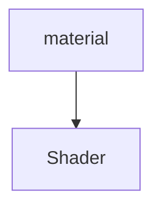

# Shaderメモ

マテリアルと1対１で結びつく



## Shaderの種類


- Surface Shader
  - Unityの独自よりの、比較的簡単に記述できるシェーダー
  - 光源、影の付き方を考慮せずに書くことができる(メリット・デメリット)
  - 色、質感、テクスチャ周りを簡単に変更したいときに使う
- Unlit Shader
  - Shader界では、`Vertex`,`Fragment Shader`と呼ばれている
  - Unlit : Un Lighted, Un Illuminated
  - Vertex Shader : 頂点を制御するシェーダー
  - Fragment Shader : 最終的な出力を決定するシェーダー
  - 光源の影響を受けないシェーダー
  - Surface Shaderより、`光源や影`を考慮して実装する必要があるため、記述レベルは高い
- Image Effect Shader
  - ポストエフェクトなどに使用するシェーダー
- Compute Shader
  - GPUを使うことができるシェーダー
- Ray Tracing Shader

### 参考
Shader について
- http://neareal.com/2413/#vertexfragment

# Surface Shader

頂点情報の変更や、光源、影の付け方についての記述はできない

具体的な処理の記述は、`surf関数`内に記述していきます。
- 具体的に表現すると、`SurfaceOutputStandard`が次の処理(lighting)への参照になるので、次の処理へ渡す値を設定している
  - o.Albedo : この`o`が次の処理への参照変数なので、その変数の`Albedo`というメンバ変数を変更することで結果が変わるということになる。

### SurfaceOutputStandardが持っている情報

```c#
struct SurfaceOutputStandardSpecular
{
    fixed3 Albedo;      // ディフューズ色
    fixed3 Specular;    // スペキュラー色
    fixed3 Normal;      // 書き込まれる場合は、接線空間法線
    half3 Emission;
    half Smoothness;    // 0=粗い, 1=滑らか
    half Occlusion;     // オクルージョン (デフォルト 1)
    fixed Alpha;        // 透明度のアルファ
};
```

### 色を決め打ちで設定しているShader
このシェーダーは、外部から設定できる情報は何もなく、決められた色を表現するしかできないシンプルなシェーダー
```c
Shader "DShader/Simple"
{
  //  Parameters
  //  Parameters
  SubShader
  {
    //  Shader Settings
    Tags { "RenderType"="Opaque" }
    LOD 200

    CGPROGRAM
    #pragma surface surf Standard fullforwardshadows
    #pragma target 3.0
    //  Shader Settings

    //  Surface Shader
    //  前の工程(Vertex)のシェーダーからの情報を受け取る
    struct Input
    {
      float2 uv_MainTex;
    };

    // あとの工程(Lighting)に出力する
    void surf (Input IN, inout SurfaceOutputStandard o)
    {
      o.Albedo = fixed4(1.0f,1.0f,1.0f,1);
    }
    ENDCG
    //  Surface Shader

  }
  FallBack "Diffuse"
}
```

- Parameters
  - インスペクタに公開する変数を書く
- Shader Settings
  - ライティングや透明度などのシェーダの設定項目を記述
- Surface Shader
  - シェーダ本体のプログラム

Surface Shaderには、`入力`と`出力`がある

- 入力
  - `Input構造体`の中身が空ではコンパイルが通らない
  ```c#
  struct Input
  {
    float2 uv_MainTex;
  };
  ```

- 出力
  ```c#
  void surf (Input IN, inout SurfaceOutputStandard o)
  {
    o.Albedo = fixed4(1.0f,1.0f,1.0f,1);
  }
  ```

### 入力
- float3 viewDir - ビュー方向を含みます。視差効果、リムライティングなどの計算に使用されます。
- float4 with COLOR セマンティック - 補間された頂点ごとの色を含みます。
- float4 screenPos - 反射、または、スクリーンスペースエフェクトのためのスクリーンスペース位置を含みます。これは、GrabPass には適していないので注意してください。GrabPass のためにはComputeGrabScreenPos 関数でカスタム UV を算出する必要があります。
- float3 worldPos - ワールド空間の位置を含みます。
- float3 worldRefl - サーフェスシェーダーが o.Normal に書き込まない場合 のワールドの反射ベクトルを含みます。例については、反射―デフューズシェーダーを参照してください。
- float3 worldNormal - サーフェスシェーダーが o.Normal に書き込まない場合 のワールドの法線ベクトルを含みます。
- float3 worldRefl; INTERNAL_DATA - サーフェスシェーダーが o.Normal に書き込む場合 のワールドの反射ベクトルを含みます。ピクセル法線マップに基づいて反射ベクトルを取得するには、WorldReflectionVector (IN, o.Normal) を使用します。例については、反射-Bumped シェーダーを参照してください。
- float3 worldNormal; INTERNAL_DATA - サーフェスシェーダーが o.Normal に書き込む場合 のワールドの反射ベクトルを含みます。ピクセル法線マップに基づいて法線ベクトルを取得するには、WorldNormalVector (IN, o.Normal) を使用します。

### 外部からシェーダーのパラメーターを変更する

パラメーターを変更するには、2種類の方法があります。

1. Inspectorから手動で変更する
2. スクリプトからコードで変更する

#### 1. Inspectorから手動で変更する

Inspectorに表示する項目を`Parametersブロック`で定義する必要があります。

注意点として、`Parametersブロック`で定義した項目は、`Surfaceブロック`で更に同じ変数を定義しなければ`surfメソッド`内で使うことができないので注意が必要です。

```c#
Shader "DShader/SimpleTransparent"
{
  Properties{
    //  InspectorにBase Colorとして表示される
    _BaseColor("Base Color",Color) = (1,1,1,1)
  }

  SubShader {

    //  ....省略

    //  SubShader内でPropertiesの項目を使用できるようにするには、内部でも宣言する必要がある
    float4 _BaseColor;

    void surf (Input IN, inout SurfaceOutputStandard o) {
      //  色を適応
      o.Albedo = _BaseColor.rgb;
    }
    ENDCG
  }
  FallBack "Diffuse"
}
```

#### 2. スクリプトからコードで変更する

Inspectorから設定しないのであれば、Propertiesブロックは不要で、Surfaceブロック内の定義のみで大丈夫です

- Shader

```c#
Shader "DShader/SimpleTransparent"
{
  Properties{
    //  InspectorにBase Colorとして表示される
    //  _BaseColor("Base Color",Color) = (1,1,1,1)
  }

  SubShader {
    //  ....省略

    //  外部からはSubShader内のメンバ変数にアクセスできる
    float4 _BaseColor;

    void surf (Input IN, inout SurfaceOutputStandard o) {
      //  色を適応
      o.Albedo = _BaseColor.rgb;
    }
    ENDCG
  }
  FallBack "Diffuse"
}
```

- スクリプト

```c#
Get
```

